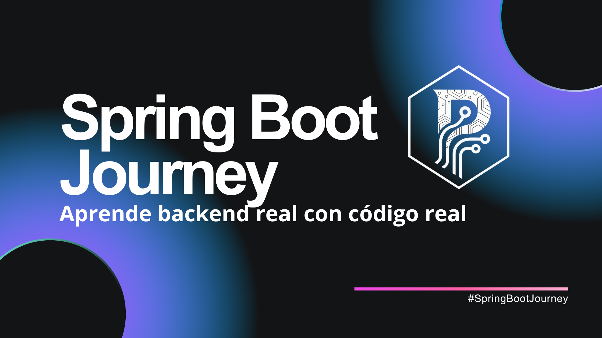

# 🚀 Spring Boot Journey — by Payoyo Tech

Aprende **Spring Boot paso a paso** con teoría, ejercicios y ejemplos reales.
Cada jueves una nueva lección: #SpringBootJourney 💻

---

## 📚 Qué aprenderás
✅ Fundamentos de Spring Boot  
✅ JPA, relaciones y DTOs  
✅ Seguridad con JWT  
✅ Testing y Docker  
✅ Proyecto final de producción  

---

## 🗓️ Roadmap
| Semana | Tema | Estado |
|--------|------|--------|
| 1 | Fundamentos | ✅ |
| 2 | Controladores REST | 🔜 |
| 3 | Inyección de dependencias | ... |

---

## 📘 Cómo seguir el curso
1. Lee la teoría (PDF o README)  
2. Haz los ejercicios en tu entorno  
3. Envía un Pull Request con tu solución  
4. Te daré feedback directamente  

---

## 🌐 Síguelo en LinkedIn
Publico una lección nueva **cada jueves** 👉 [linkedin.com/in/payoyo](https://www.linkedin.com/in/jose-luis-rodriguez-valenzuela-dev/)]

---

  

